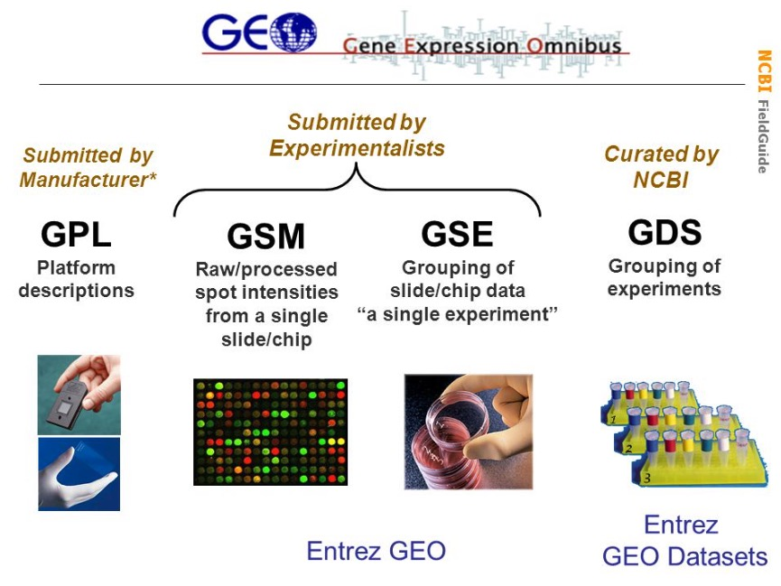

# Prediction of Experimental Metadata from Gene Expression

## Pipeline
- Data collection from [[GEO](https://www.ncbi.nlm.nih.gov/geo/info/datasets.html)] library
- Annotations of Platforms

### GEOparse
Installation:

    pip install GEOparse

[[Usage:](https://geoparse.readthedocs.io/en/latest/usage.html)]

```python
gse = GEOparse.get_GEO(geo="GSE1563", destdir="./")

gse.gsms.items()  # pairs of `gsm_name` and `gsm`
gse.gpls.items()  # pairs of `gpl_name` and `gpl`
```

##### GEO Terms
- `GSE` (Series) is a record that summarizes whole study including samples and platforms
    - `GPL` (Platform) contains mappings from probe IDs to RefSeq IDs
    - `GSM` (Sample) contains information about the conditions and preparation of a Sample

<div style="text-align:center"></div>

## Methods
- Quantile Normalization [[wiki](https://en.wikipedia.org/wiki/Quantile_normalization)] [[machinelearning.ru](http://www.machinelearning.ru/wiki/index.php?title=Нормализация_ДНК-микрочипов)]

## References
- Improving the value of public RNA-seq expression data by phenotype prediction [[bioRxiv](http://www.biorxiv.org/content/biorxiv/early/2017/06/03/145656.full.pdf)]
- MAnorm: a robust model for quantitative comparison of ChIP-Seq data sets [[BioMed Central](https://genomebiology.biomedcentral.com/track/pdf/10.1186/gb-2012-13-3-r16?site=genomebiology.biomedcentral.com)]
- A Python module to normalize microarray data by the quantile adjustment method [[PubMed Central](https://www.ncbi.nlm.nih.gov/pmc/articles/PMC3087835/#R6)]
